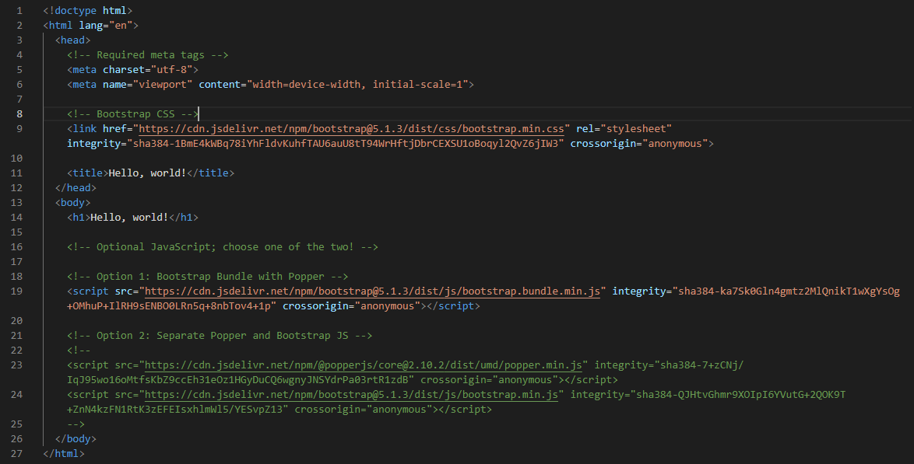

# Lab6Web
Web Framework (Bootstrap)

## Pertama-tama Masukkan tag Template Bootstrap di dalam HTML

*Lalu buat tag navbar seperti berikut.*

Dan Tampilannya seperti ini.

*Lalu membuat div dengan class Container*

*Membuat section*

*Dengan menambahkan style css*

Hasilnya

*Membuat tampilan widget*

style css

Tampilannya

*Menambahkan Footer*

Style css nya.

*Menambahkan script yang berfungsi untuk javascript dalam boostrap agar dropdown dapat dengan berfungsi dengan meletakkan script di dalam body*

## Hasil Tampilan Keseluruhannya Seperti Berikut.

